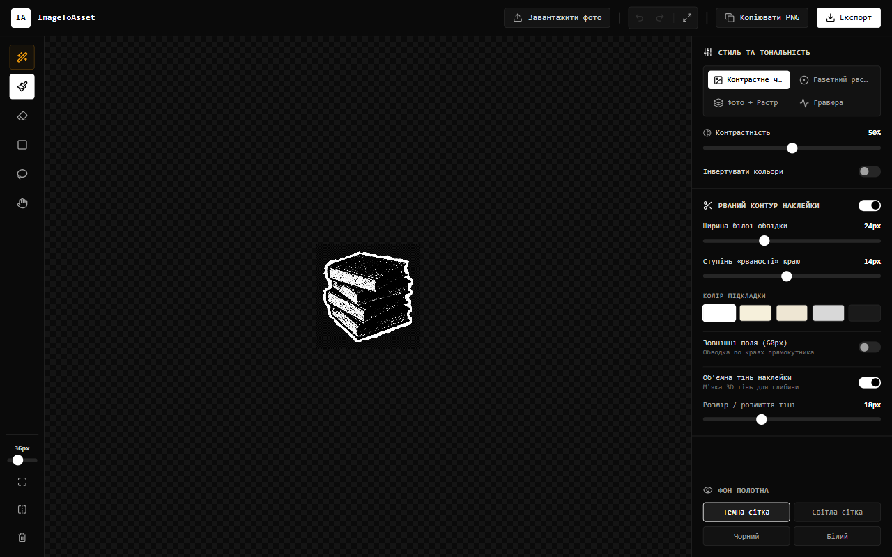
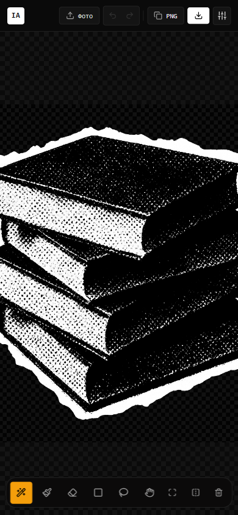
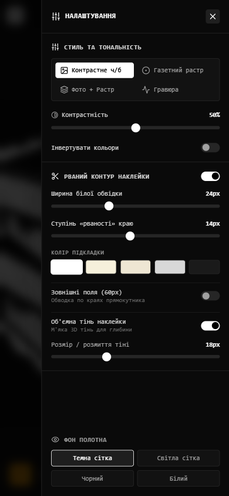

# ImageToAsset - Halftone Sticker & Asset Studio

> Інтерактивна веб-студія для виділення об'єктів на будь-яких фотографіях та їхньої трансформації у монохромні презентаційні асети в стилі Halftone / Newsprint / Engraving з автентичним рваним контуром паперової наклейки (Torn Paper Edge) та об'ємною 3D тінню на прозорому фоні.

---

## Інтерфейс студії

### Десктопна версія

### Мобільна версія та адаптація

  
  &nbsp; &nbsp;
  

---

## Особливості та можливості

- **Автентичний графічний стиль Halftone**:
  - Точне півтонове растрування регулярною крапковою сіткою (Halftone Dot Matrix) під кутом 45° з динамічним радіусом крапок від яскравості.
  - Повнодіапазонні тональні режими: контрастне ч/б (grayscale-contrast), газетний растр (dots), гібрид фото + растр (hybrid) та ретро-гравюра (engraving).
  - Тонке регулювання контрастності та інверсії кольорів (негатив для темних слайдів).

- **Генератор рваного паперового краю (Torn Paper Deckle Edge)**:
  - Точний (N)$ евклідовий розрахунок дистанції від контуру виділеного об'єкта (алгоритм 8SED).
  - Фрактальний шум (fBM / Simplex Noise) для моделювання природного рваного паперу та волокон по периметру.
  - Пом'ята текстура паперу (Crumpled Paper) з діагональними заломами та рельєфним світлотіньовим моделюванням.
  - Палітра кольорів підкладки: білий, вінтажний кремовий (#f6f0db), світло-бежевий пергамент, сірий та темний графіт.
  - М'яка об'ємна 3D тінь наклейки з регулюванням розміру та розмиття.

- **Гібридні інструменти виділення та сегментації**:
  - **Розумне ласо (W)**: інтерактивне виділення контуру з бар'єром першого зіткнення (First-Hit Edge Barrier) та захистом одягу/деталей (Depth Fence 28px).
  - **Пензель маски (B)** та **Ластик (E)**: миттєве малювання зі синхронним 60 FPS попереднім переглядом без затримок та помаранчевим курсором точного радіуса.
  - **Виділення прямокутником (M)** та **Довільне ласо (L)**: виділений об'єкт автоматично ізолюється, а все за межами стирається (з підтримкою Shift для додавання та Alt для віднімання).
  - **Швидкі операції**: Виділити все, Інвертувати маску, Очистити все.

- **Миттєвий експорт та буфер обміну**:
  - **Копіювання PNG (Ctrl + C)**: миттєве копіювання прозорого вирізаного PNG-асету в буфер обміну для вставки в PowerPoint, Keynote, Figma, Canva або месенджери.
  - **Експорт в 1 клік**: автоматичне кадрування навколо наклейки зі збереженням зображення, обводки та тіні без фону.
  - **Вставка з буфера (Ctrl + V)** та Drag & Drop файлів.

- **Повна адаптивність та мультитач-жести**:
  - Мобільний плаваючий док інструментів із регулюванням розміру пензля.
  - Висувна панель налаштувань (Slide-Over Drawer) із розмиттям фону.
  - Мультитач-жести: Pinch-to-Zoom двома пальцями та плавне малювання одним дотиком.

---

## Швидкий запуск

`ash
# 1. Клонування репозиторію
git clone https://github.com/SeriySpray/ImageToAsset.git
cd ImageToAsset

# 2. Встановлення залежностей
npm install

# 3. Запуск локального сервера розробки
npm run dev
`

Додаток відкриється за адресою: http://localhost:3000

---

## Гарячі клавіші

| Клавіша | Дія |
| :--- | :--- |
| Ctrl + V | Вставити фото з буфера обміну |
| Ctrl + C | Скопіювати прозорий PNG асет у буфер обміну |
| Ctrl + Z / Ctrl + Y | Скасувати / Повторити дію з маскою |
| Ctrl + Shift + Z | Повторити дію з маскою |
| Space + Drag / H | Панорамування робочої області (Pan) |
| Колесо миші | Плавний центрований зум сцени |
| [ / ] | Зменшити / Збільшити радіус пензля |
| W | Розумне ласо (Smart Magic Wand) |
| B / E | Пензель (Brush) / Ластик (Eraser) |
| M / L | Прямокутне виділення / Довільне ласо |

---

## Технологічний стек

- **Frontend**: React 19, TypeScript, Vite
- **UI & Стилізація**: Tailwind CSS v4, Lucide Icons, шрифтова гарнітура JetBrains Mono
- **Графічний рушій**: HTML5 Canvas 2D API, Euclidean Distance Transform (8SED), Simplex Noise & fBM
- **Архітектура**: 32-бітний растровий скрин, O(1) таблиці підстановки (LUT), субтрактивна ізоляція та апаратний композитинг
